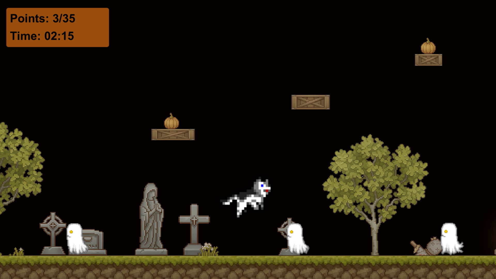

# Pumpkin Dog's Graveyard Adventure

*Pumpkin Dog's Graveyard Adventure* is a 2D platformer game where your goal is to collect all the pumpkins at the graveyard while avoiding the ghosts. It was inspired by my all-time favourite game,  [Monster Bash](https://en.wikipedia.org/wiki/Monster_Bash).

You can download the game from [Itch](https://hetabjorklund.itch.io/pumpkin-dog). Start the game by opening the *Pumpkin Dog's Graveyard Adventure.exe* file. Don't move the .exe file from the folder - there are hidden files included in the folder that are required for the .exe file to work.

# How to play
* Press any key to continue on to the game or press ESC to quit.
* Move left and right with the arrow keys, jump with the space bar.
* Collect all the pumpkins! You get one point from each pumpkin.
* Avoid the ghosts: you lose a point every time you hit one.
* If you collect all the pumpkins in under 50 seconds, you get a time bonus!

# Creator
Heta Björklund
 * GitHub: https://github.com/hetabjorklund
 * LinkedIn: https://www.linkedin.com/in/heta-bjorklund

# Acknowledgements

Made with [Unity](https://unity.com/).

Thank you to all the friends and family who test-played the game: Elina, Laura, Sara, Tuomo, Anna, Saara, Kerttu, Inkeri, Dad, Tiina & Einar.

## Background and game elements
[Pixel Art Platformer - Village Props by Cainos](https://assetstore.unity.com/packages/2d/environments/pixel-art-platformer-village-props-166114).

## Font
[FixedSys](https://fontsgeek.com/fonts/fixedsys-excelsior-301-regular).

## Ghost
[Ghosts sprite](https://rpgtileset.com/sprite/ghosts-sprite-for-rpg-maker-mv/) by [rpgtileset](https://www.pinterest.com/rpgtileset/).

## Player
[Husky sprites](https://opengameart.org/content/husky-sprites) by [Hellkipz](https://opengameart.org/users/hellkipz) and [Shepardskin](https://opengameart.org/users/shepardskin).

## Sounds and music
Background music: [Foggy Forest](https://www.playonloop.com/2019-music-loops/foggy-forest/).\
Ghost sound: cut from [UFO Takeoff by Sonidor](https://soundbible.com/2064-UFO-Takeoff.html).\
Pumpkin sound: [Apple Bite by Simon Craggs](https://soundbible.com/1968-Apple-Bite.html).
